<!-- Header -->
<div align="center">



</div>

---

## `whoami`

```kotlin
object HazratUmmar {
    val name        = "Hazrat Ummar"
    val username    = "ihazratummar"
    val location    = "West Bengal, India 🇮🇳"
    val role        = "Android Apps | Backend | Discord Bot Developer"
    val focus       = listOf("Kotlin", "Jetpack Compose", "Clean Architecture", Discord.py, KPM)
    val currentlyWorking = "Kotlin Multiplatform + AI integrations | Discord Bot"
    val openToWork  = true

    fun greet() = "Hey! Thanks for visiting my profile 👋"
}
```

---

## `tech.stack()`

<div align="center">



### Tools & Environment


</div>

---

## `git log --stats`

<div align="center">


</div>

<div align="center">


</div>

---

## `./contributions --visualize`

<div align="center">


</div>

---

## `ls ./projects`

<div align="center">
<table>
  <tr>
    <td>
      <a href="https://github.com/ihazratummar/OneDrop-Backend">
        
      </a>
    </td>
    <td>
      <a href="https://github.com/ihazratummar/Nexa">
        
      </a>
    </td>
  </tr>
  <tr>
    <td>
      <!-- Add repo 3 here: change repo=REPO_NAME and href -->
      <a href="https://github.com/ihazratummar">
        
      </a>
    </td>
    <td>
      <!-- Add repo 4 here: change repo=REPO_NAME and href -->
      <a href="https://github.com/ihazratummar">
        
      </a>
    </td>
  </tr>
</table>
</div>

---

## `trophy --all`

<div align="center">


</div>

---

## `./connect --social`

<div align="center">

[](https://www.linkedin.com/in/crazyforsurprise/)
[](https://www.instagram.com/ummaroyin/)
[](https://discord.com/users/475357995367137282)

</div>

---

## `git log --snake`

<div align="center">

<div style="position: relative; width: 100%;">

  

  

</div>

</div>
---

<div align="center">

```
[ profile views ]──────────────────────────────────────────────
```
[](https://visitcount.itsvg.in)

<sub>Built with 💚 from West Bengal · Last updated 2025</sub>

</div>